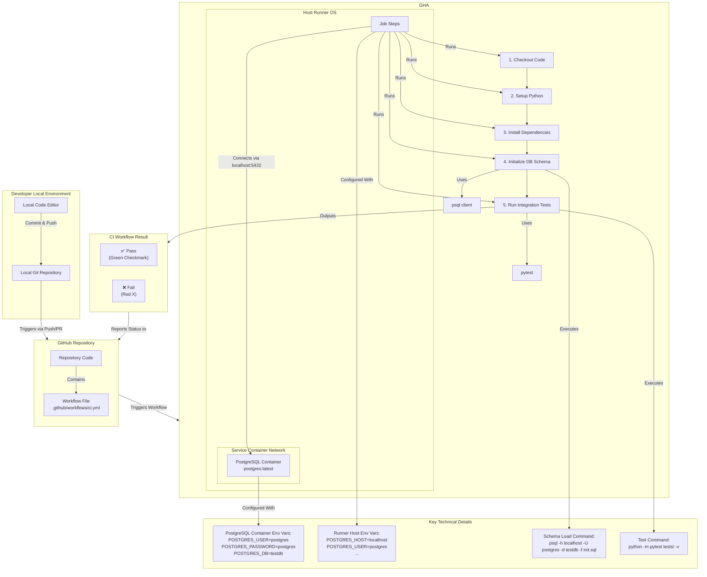

Of course! Here is a comprehensive and professional `README.md` file for your project, complete with badges and clear instructions.

---

# 🐍 Python CI/CD with PostgreSQL Integration Testing

[](https://www.python.org/)
[](https://www.postgresql.org/)
[](https://docs.pytest.org/)
[](https://github.com/features/actions)

A demonstration of a modern CI/CD pipeline using GitHub Actions to run integration tests against a real PostgreSQL database. This project highlights the best practice of testing applications with their actual service dependencies in an isolated environment.

## 🚀 Features

- **🧪 Real Integration Tests:** Tests run against a live PostgreSQL instance, not mocks.
- **⚙️ Automated CI/CD:** Fully automated testing on every push and pull request via GitHub Actions.
- **🐳 Service Containers:** Uses Dockerized PostgreSQL for clean, ephemeral testing environments.
- **📦 Dependency Management:** Simple setup with `requirements.txt`.
- **🔧 Robust Configuration:** Includes health checks and connection waiting logic for reliability.

## 📁 Project Structure

```
python-postgres-ci/
├── .github/workflows/
│   └── ci.yml                 # GitHub Actions CI workflow definition
├── app/
│   ├── __init__.py           # Makes app a Python package
│   └── db.py                 # Database connection and logic
├── tests/
│   └── test_db_integration.py # Integration tests
├── init.sql                  # Database schema and seed data
├── requirements.txt          # Python dependencies
└── README.md                 # This file
```





## ⚙️ Prerequisites

- **Python 3.11+**
- **Git**
- **A GitHub Account**
- *(Optional)* **Local PostgreSQL Server** (for running tests locally)

## 🛠️ Local Development Setup

1.  **Clone the repository**
    ```bash
    git clone https://github.com/YOUR_USERNAME/python-postgres-ci.git
    cd python-postgres-ci
    ```

2.  **Create a virtual environment and install dependencies**
    ```bash
    python -m venv venv
    source venv/bin/activate  # On Windows: venv\Scripts\activate
    pip install -r requirements.txt
    ```

3.  **(Optional) Run tests locally against a local PostgreSQL instance**
    - Start your local PostgreSQL server.
    - Create a database (e.g., `testdb`).
    - Run the `init.sql` script on that database.
    - Set the required environment variables:
    ```bash
    export POSTGRES_HOST=localhost
    export POSTGRES_USER=your_username
    export POSTGRES_PASSWORD=your_password
    export POSTGRES_DB=testdb
    export POSTGRES_PORT=5432
    ```
    - Run the test:
    ```bash
    python -m pytest tests/test_db_integration.py -v
    ```
    *Note: The test is expected to fail if no local database is running, which is normal.*

## 🤖 How the CI/CD Pipeline Works

The magic happens in the [`.github/workflows/ci.yml`](.github/workflows/ci.yml) file. Here's what it does on every push to `main` or pull request:

1.  **🏗️ Build Environment:** GitHub spins up an `ubuntu-latest` runner.
2.  **🐘 Start PostgreSQL:** A `postgres:latest` Docker container is started as a service.
3.  **📦 Setup Python:** The specified version of Python is installed on the runner.
4.  **📋 Install Dependencies:** Dependencies from `requirements.txt` are installed.
5.  **🗃️ Initialize Database:** The `init.sql` schema is loaded into the running PostgreSQL service.
6.  **🧪 Run Tests:** Pytest executes the integration test against the live database.
7.  **✅ Pass/Fail:** The workflow succeeds if all tests pass, providing a green checkmark on your commit.

### Key CI Configuration Details:

- **Service Access:** The job runs on the host runner, so the PostgreSQL service is accessed via `localhost:5432`.
- **Health Checks:** The PostgreSQL service container is configured with a health check to ensure it's ready.
- **Robust Waiting:** The workflow includes a script to wait for the database to be accept connections before running the schema script, preventing race conditions.

## 📊 Example CI Workflow Output

On a successful run, you will see:
```
...
Run integration tests with pytest
  python -m pytest tests/test_db_integration.py -v
  ============================= test session starts ==============================
  platform linux -- Python 3.11.9, pytest-8.2.1, pluggy-1.5.0 -- /opt/hostedtoolcache/Python/3.11.9/x64/bin/python
  cachedir: .pytest_cache
  rootdir: /home/runner/work/python-postgres-ci/python-postgres-ci
  collected 1 item

  tests/test_db_integration.py::test_get_users PASSED                     [100%]

  =============================== 1 passed in 0.12s ===============================
```

## 🧪 Understanding the Test

The integration test in `tests/test_db_integration.py` is simple but powerful:
- **Connects** to the database using the app's `get_db_connection()` function.
- **Queries** for all users in the `users` table.
- **Asserts** that the number of users and their names match the data inserted by `init.sql`.

This validates the entire stack: connection logic, database schema, and query execution.

## 🚢 How to Extend This Project

This template can be easily adapted for other services and use cases:

1.  **Different Database:** Replace the `postgres` service with `mysql`, `redis`, or `mongo`. Update the connection logic in `app/db.py` and the client installation in the workflow.
2.  **More Complex Schema:** Add more tables and relationships to `init.sql` and write corresponding tests.
3.  **Application Code:** Add a web framework like Flask or FastAPI on top of this data layer and write endpoint tests.

## 📜 License

This project is licensed under the MIT License - see the [LICENSE](LICENSE) file for details.

## 🙌 Contributing

Contributions, issues, and feature requests are welcome! Feel free to check the [issues page](../../issues).

---

**⭐ If this project helped you learn about CI/CD and integration testing, please give it a star!**